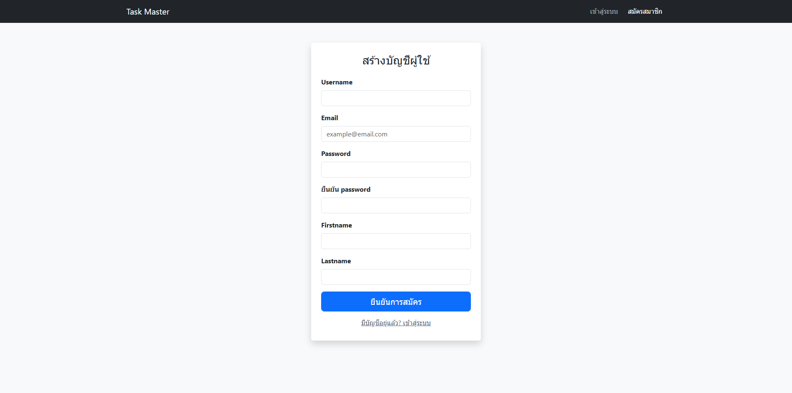
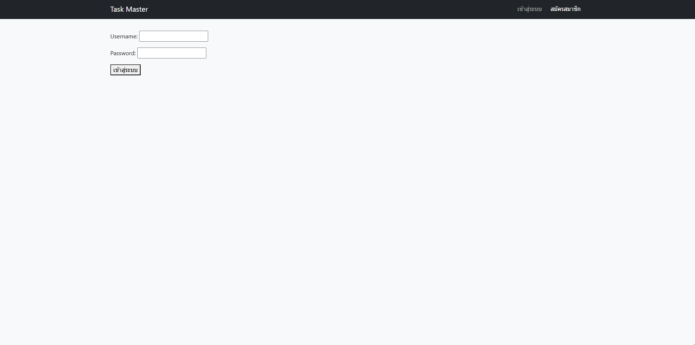
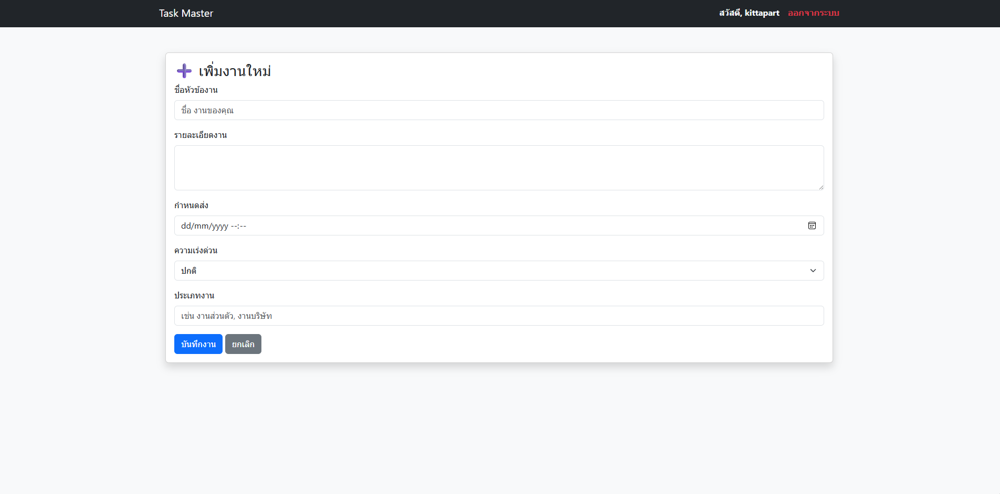
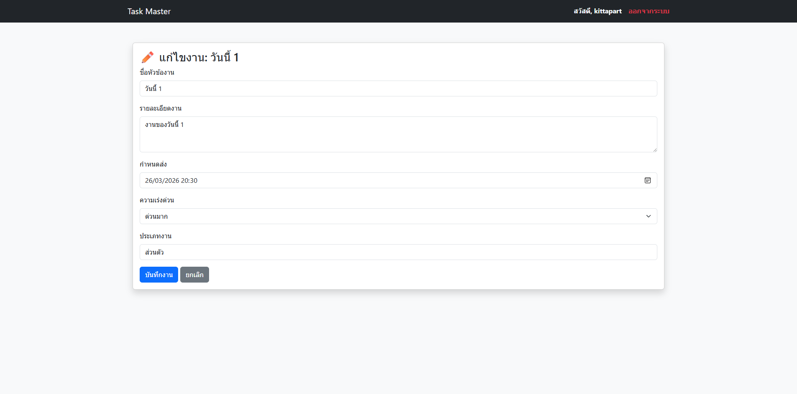
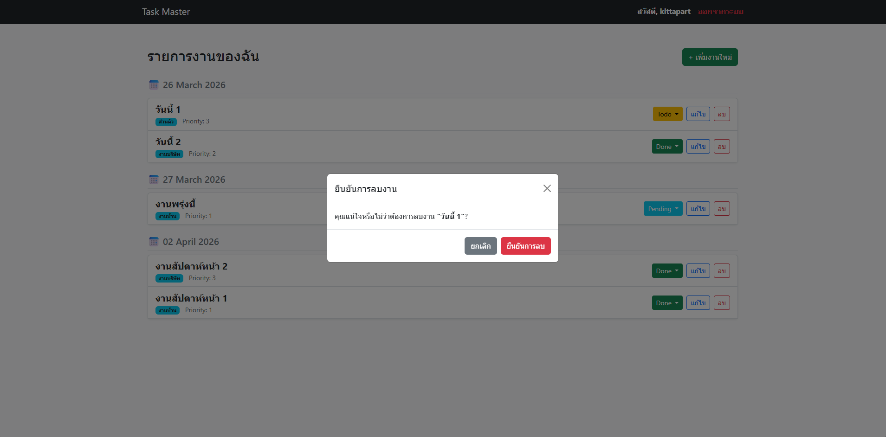
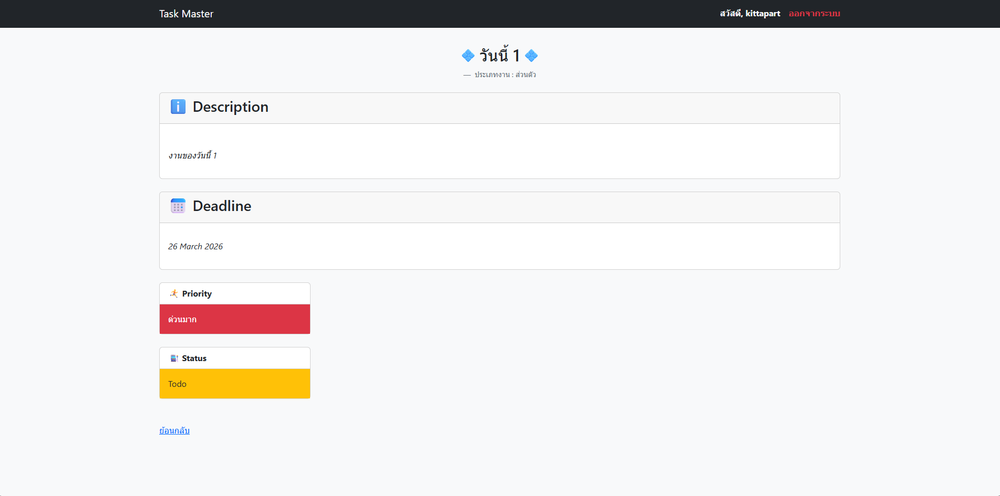
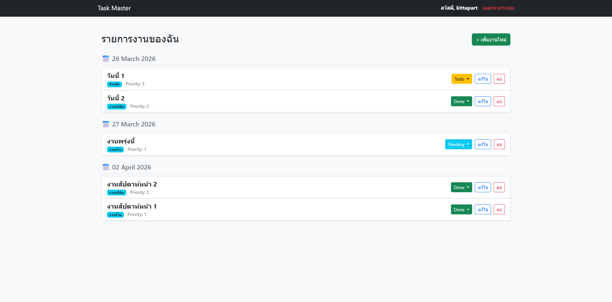

📝 Django Task Manager
ระบบจัดการรายการงาน (Task Management System) ที่พัฒนาด้วย Python Django และตกแต่งหน้าตาด้วย Bootstrap 5 โดยเน้นความง่ายในการใช้งานและระบบความปลอดภัยเบื้องต้น

✨ คุณสมบัติของโปรเจกต์ (Features)
User Authentication: ระบบสมัครสมาชิกและเข้าสู่ระบบ (Login/Logout)
### หน้าสมัครสมาชิก (Register)

### หน้าเข้าสู่ระบบ (Login)

Personalized Tasks: ผู้ใช้งานจะเห็นและจัดการได้เฉพาะงานของตัวเองเท่านั้น

CRUD Operations: สามารถ เพิ่ม, ดูรายละเอียด, แก้ไขสถานะ และลบงานได้ครบถ้วน
### หน้าเพิ่มงาน

### หน้าแก้ไขงาน

### หน้าลบงาน

### หน้าดูรายละเอียดงาน

Task Grouping: ระบบจัดกลุ่มงานตามวันที่ (Deadline) โดยอัตโนมัติ

### หน้ารายการงาน (Task List)

Responsive Design: หน้าตาเว็บปรับเปลี่ยนตามขนาดหน้าจอ (Mobile Friendly) ด้วย Bootstrap

Priority & Status System: ระบบคัดกรองความสำคัญและสถานะงานพร้อมสีสันที่ชัดเจน

🛠️ เทคโนโลยีที่ใช้ (Tech Stack)
Backend: Django 5.x

Frontend: HTML5, CSS3, Bootstrap 5.3

Database: SQLite (Default)

Icons: Emoji 🚀📅📝

🚀 การติดตั้งและเริ่มใช้งาน (Installation)

1.Clone โปรเจกต์:
Bash
git clone <link-your-repo>
cd <project-folder>

2.สร้าง Virtual Environment และติดตั้ง Dependencies:

Bash
python -m venv venv
# สำหรับ Windows
venv\Scripts\activate
# สำหรับ macOS/Linux
source venv/bin/activate

pip install django

3.จัดการฐานข้อมูล (Migrations):

Bash
python manage.py makemigrations
python manage.py migrate

4.เริ่มรัน Server:

Bash
python manage.py runserver
จากนั้นเปิด Browser ไปที่ http://127.0.0.1:8000/

📁 โครงสร้างไฟล์ที่สำคัญ

models.py: กำหนดโครงสร้างตาราง Task (Priority, Status, User Relationship)

views.py: จัดการ Logic CRUD และการเช็คสิทธิ์ get_object_or_404(owner=request.user)

templates/: ไฟล์ HTML ที่ใช้ระบบ Template Inheritance (base.html)